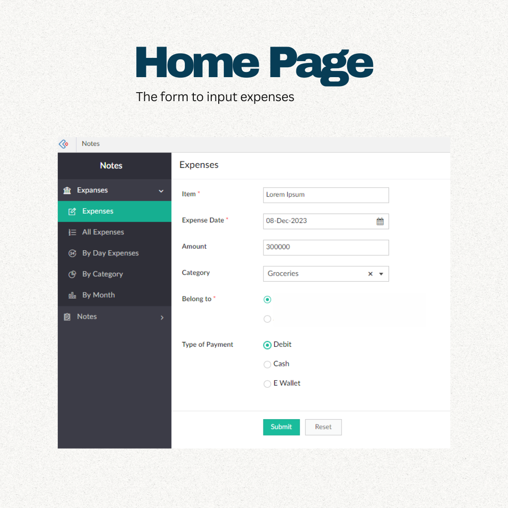
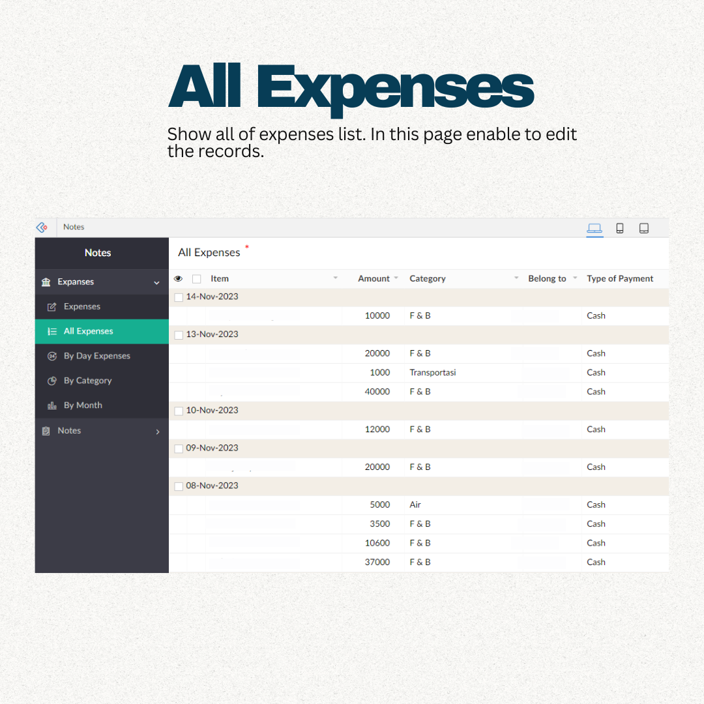
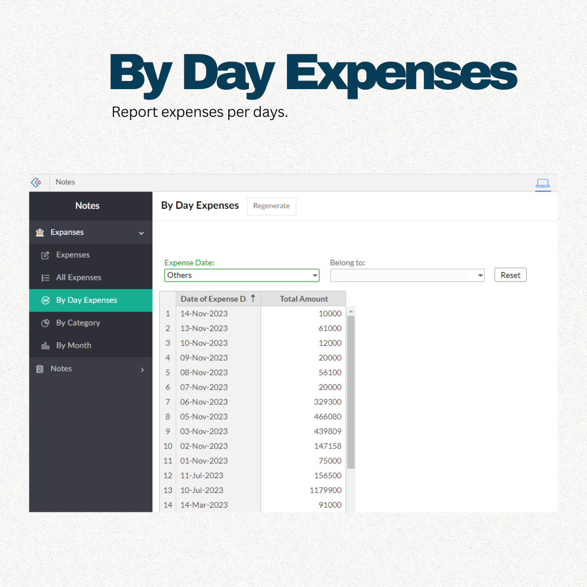
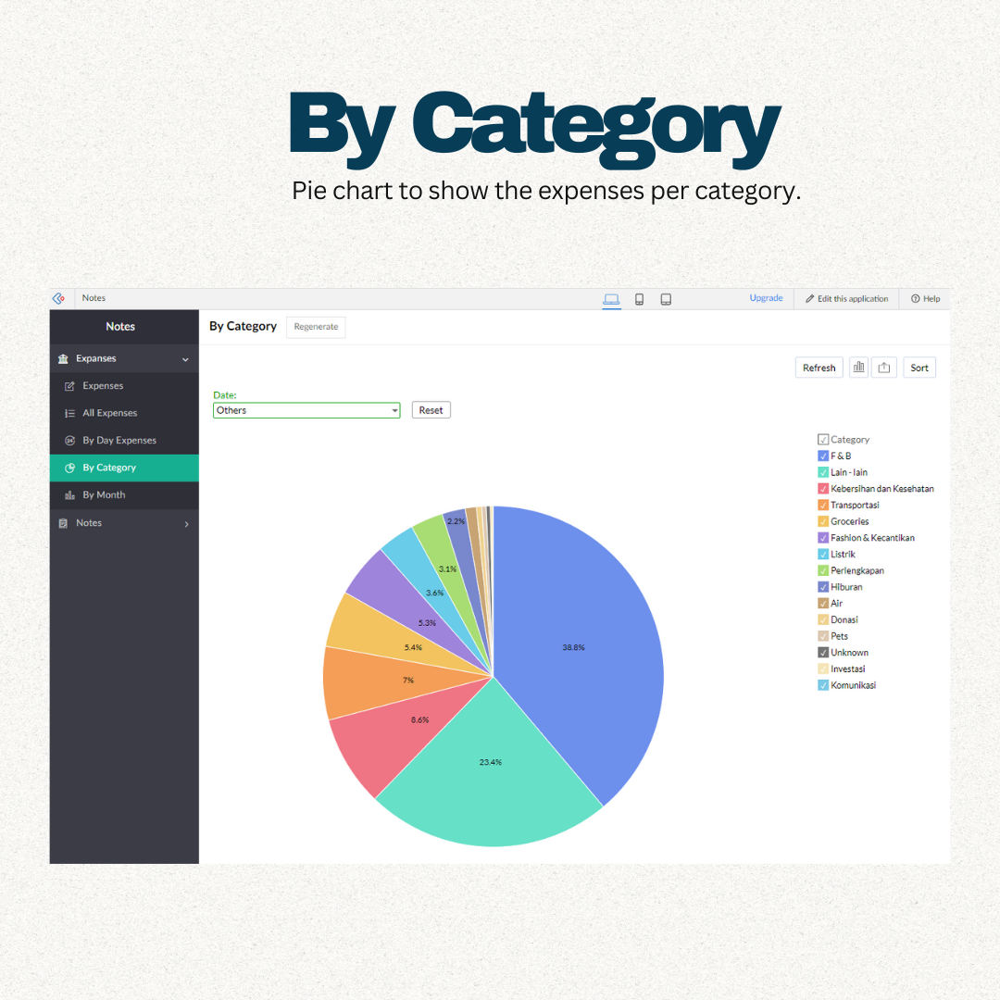
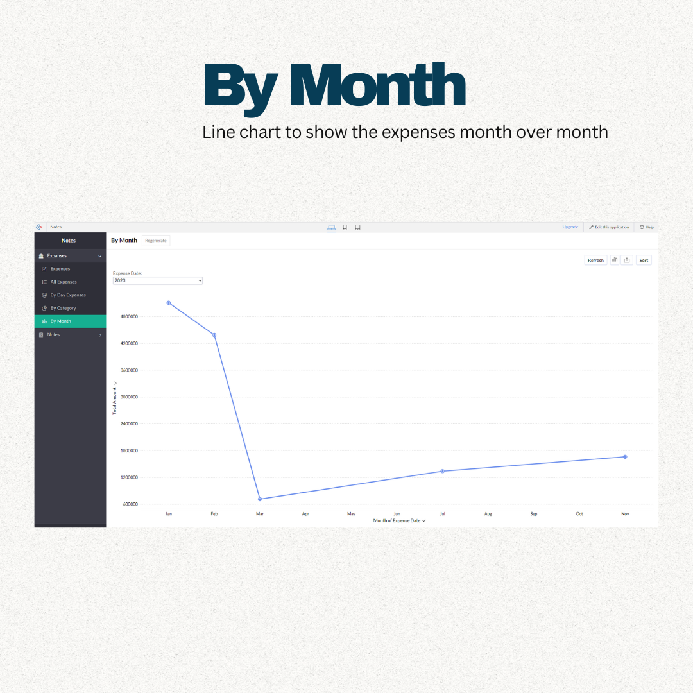

# Expense-App-Project-04
This is an expense application creation project.
This application is used for input and get report of expenses. It has the form to input and the report to monitor the expenses. This application was developed using **Zoho Creator**, which can be accessed by web or mobile phone.

### Application Screenshots

Form Input Page

   
## <!-- Horizontal Line --> ## 

All Expenses Page

   
## <!-- Horizontal Line --> ## 

By Day Expenses Page

   
## <!-- Horizontal Line --> ## 

By Category Page

   
## <!-- Horizontal Line --> ## 

By Month Page

   
## <!-- Horizontal Line --> ## 

